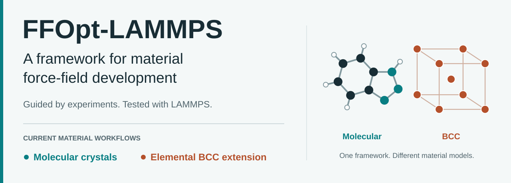

# FFOpt-LAMMPS

<p align="center">
  
</p>

[](https://github.com/Leduo-Pei/ffopt-lammps/actions/workflows/ci.yml)
[](https://github.com/Leduo-Pei/ffopt-lammps/releases)
[](https://www.python.org/)
[](LICENSE)

[中文完整手册](docs/zh_CN/USER_GUIDE.md) |
[Complete English user manual](docs/en/USER_GUIDE.md) |
[First-run guide](docs/tutorials/quickstart.md) |
[`ffopt.in` reference](docs/reference/input-file.md) |
[Releases](https://github.com/Leduo-Pei/ffopt-lammps/releases)

**Develop force-field parameters from experimental material properties.**
FFOpt is a general framework for material force-field development. It connects
parameter search, LAMMPS calculations, machine-learning models and final
validation in one restartable workflow.

You supply structures, initial parameters, allowed ranges and experimental
targets. FFOpt proposes parameter sets, calculates their properties, learns
from the results and tests the final candidates. **Machine learning guides the
search; LAMMPS provides the physical evidence.**

## Current material workflows

The framework is designed to grow across material classes. Work to date covers
**molecular crystals and elemental body-centred cubic (BCC) materials**. These
are two workflows within FFOpt, not separate software packages.

| | Molecular crystals | Elemental BCC extension |
|---|---|---|
| Current example | BTAH; packaged molecular acceptance test | Fe; experimental BCC workflow |
| Parameters | Lennard-Jones epsilon, sigma and atomic charges; selected values can be fixed | Constrained Lennard-Jones parameters; elemental charges are disabled |
| Fitting strategy | Find repeatable regions, sample nearby and improve agreement with the selected properties | Satisfy structure and surface limits, then reduce the largest configured elastic-property error |
| Calculations | Bulk structure and density, a sublimation-energy estimate, optional adsorption | Bulk and surface properties, static elasticity, finite-temperature screening and validation |
| Learning model | ANN surrogate in the molecular workflow | Gaussian-process model in the packaged BCC example |
| Start here | [Molecular guide](docs/tutorials/new-molecular-project.md) and [BTAH example](examples/btah/README.md) | [BCC guide](docs/how-to/elemental-bcc.md) and [Fe input](examples/fe_bcc/ffopt.in) |

**Current limits:** a general framework does not mean that every material or
potential form has been validated. Alloys, reactive systems and polymorph
workflows are not yet established here. Each new material requires its own
inputs, fit and validation. In particular, the two-type BCC example is an
ordered-sublattice LJ model, not a claim of a transferable elemental metal
potential. See [scientific scope](#scientific-scope).

## How it works

<p align="center">
  <a href="docs/assets/ffopt-workflow.svg">
    
  </a>
</p>

1. **Define the fit.** Choose the material, property modules, experimental targets
   and parameter bounds in `ffopt.in`.
2. **Build the evidence.** Bayesian optimization (BO) and sampling evaluate
   candidate parameters with LAMMPS. BCC adds structural constraints and elastic
   screening.
3. **Learn and refine.** A surrogate learns the stored parameter-to-property
   mapping. Active learning selects new candidates for LAMMPS, then updates the
   model with the new results. Training itself does not run MD at every epoch.
4. **Verify and export.** Repeated physical evaluations and material-specific
   checks determine the final choice. Predictions alone do not establish the
   final result.

[Detailed workflow and accuracy](docs/explanation/workflow-and-accuracy.md) |
[Editable SVG and artwork sources](docs/assets/README.md)

## One scientific input file

A user project is deliberately small:

```text
my_project/
|-- ffopt.in            # the only scientific control file
|-- data/               # user-supplied LAMMPS data files
`-- runs/               # generated automatically
```

Machine paths, MPI, CPUs, GPUs, SLURM partitions, memory, and wall time are
stored once in `~/.config/ffopt/machines.toml`. They never need to be copied
into a scientific project.

| User owns | FFOpt owns |
|---|---|
| data files, initial parameters, ranges, targets, protocol lengths | generated runtime JSON, checkpoints, scheduler scripts, models, result tables |
| `ffopt.in` | everything below `runs/` |

Do not edit generated JSON, CSV, checkpoints, or files below `runs/` to steer
a calculation. Change `ffopt.in` and start a new campaign when the scientific
input changes.

When `lmp` is already on `PATH`, `--machine local` works without a profile and
uses one serial worker. `local` executes directly on the current host and does
not submit through SLURM, so do not use it for production on a cluster login
node. A named profile is needed for explicit paths or parallel resources.

## Install

Create an isolated Python 3.11 environment, install a LAMMPS executable, then
install the current prerelease. Alpha builds are distributed as GitHub Release
wheels and are not yet published on PyPI:

```bash
python -m pip install \
  "ffopt-lammps[full] @ https://github.com/Leduo-Pei/ffopt-lammps/releases/download/v0.3.0a12/ffopt_lammps-0.3.0a12-py3-none-any.whl"
```

For development:

```bash
git clone https://github.com/Leduo-Pei/ffopt-lammps.git
cd ffopt-lammps
python -m pip install -e ".[full,dev]"
python -m pytest -q
```

LAMMPS is an external dependency. A CPU-only PyTorch installation is valid;
`torch.cuda.is_available() == False` is not an error on a CPU machine profile.

## Configure and verify a machine

```bash
ffopt machine probe --partition YOUR_PARTITION
ffopt machine configure --auto --name cluster-1node \
  --backend slurm --partition YOUR_PARTITION --nodes 1 --force
ffopt machine test --name cluster-1node
```

`YOUR_PARTITION` is a site-specific SLURM partition reported by `sinfo`, not a
compute-node name. Omit `--partition` from `probe` to list all visible choices.

Before fitting a new material, run the packaged scientific acceptance test:

```bash
ffopt self-test --machine cluster-1node --watch
```

The test executes the complete BTAH workflow, including validation-only
adsorption, and fails unless final LAMMPS validation satisfies the packaged
objective and property-error thresholds.
Use the same input with one- and two-node profiles to compare performance; BO
candidate batch size is independent of worker count, so the scientific budget
does not change with the machine.

## Start with an example

For BCC, use the [Fe example](examples/fe_bcc/ffopt.in) and follow the
[BCC campaign guide](docs/how-to/elemental-bcc.md). The molecular walkthrough
below uses BTAH data and a charge-only fit; its target names and modules are not
a template for every material class.

The BTAH acceptance data is included in every wheel. It can be inspected
without finding a repository checkout:

```bash
ffopt inspect builtin:data/bulk/BTAH_822_bulk.data
ffopt data check \
  --bulk builtin:data/bulk/BTAH_822_bulk.data \
  --single builtin:data/molecule/BTAH_822_single.data --strict
```

Use `ffopt self-test --prepare-only --workdir ./ffopt-btah-example` when you
want a visible local copy. Ordinary command-line relative paths are resolved
from the current shell directory; paths inside `ffopt.in` are resolved from
the input file's directory.

For your own material, validate the data contract first:

```bash
ffopt data check --bulk crystal.data --single molecule.data
```

Then generate a reviewable starting input:

```bash
ffopt init my_crystal \
  --bulk-data crystal.data \
  --single-data molecule.data \
  --cells 2 2 2 \
  --mode charge_only \
  --target a=10.1,1.0,A \
  --target density=1.25,1.0,g/cm3 \
  --target sublimation=80.0,0.3,kJ/mol
```

`ffopt init` reads type labels, LJ values, and charges from the data file and
writes them explicitly. It does not assume that the inferred values or ranges
are chemically correct; review every `type`, `range`, `fix`, and `target` line.

## Check, run, resume

```bash
cd my_crystal
ffopt check ffopt.in
ffopt explain ffopt.in
ffopt doctor ffopt.in --machine cluster-1node
ffopt run ffopt.in --machine cluster-1node --dry-run
ffopt run ffopt.in --machine cluster-1node --watch
```

`doctor` checks the Python runtime, executables, scheduler, and compatibility
of all active LAMMPS data files before an expensive run. Normal input errors
are concise; prepend `ffopt --debug` only when a full Python traceback is
needed for troubleshooting.

Repeat the last command after logout, timeout, or node failure. FFOpt verifies
stage artifacts and resumes the first incomplete stage. To stop after BO while
keeping the full workflow in the input, use `--until bo`; later continue with
`--from-stage sample`. Use `--new` only for an independent campaign.

```bash
ffopt status ffopt.in --machine cluster-1node
ffopt logs ffopt.in --stage bo --lines 100
ffopt results ffopt.in
```

Final validation writes the resolved per-type force-field parameters,
calculated-versus-target properties, pass/fail gates, structures, and
trajectories under `runs/<project>/pipelines/<run-id>/validate/`.

## Molecular input at a glance

```text
ffopt 1
project example
workflow bo sample nn al audit finalize validate

parameters
    range charge  delta  0.30
    cutoff 8.0 A
    charge_limit 1.0
    neutrality derive N1
    mixing epsilon geometric
    mixing sigma geometric
    fix epsilon sigma
    type 1 N1 0.20 3.30 -0.50
    type 2 H1 0.03 2.42  0.50
end
```

This compact example is charge-only, so only charge needs a range. No `fix`
line plus epsilon/sigma/charge ranges produces full optimization. The derived
charge is removed from the independent search space and recovered from exact
total neutrality. `cutoff` is one required global scientific setting shared by
all fitted and validation properties; FFOpt never substitutes a hidden
property-specific default. Elemental BCC inputs must use at least
`2.5 * sigma_max` over the complete declared sigma search domain and at most
`0.45 * h_min` for every replicated periodic cell.

## Documentation

- [Complete English user manual](docs/en/USER_GUIDE.md)
- [Complete Chinese user manual](docs/zh_CN/USER_GUIDE.md)
- [First-run setup and acceptance](docs/tutorials/quickstart.md)
- [FFOpt input reference](docs/reference/input-file.md)
- [Machine profile reference](docs/reference/machine-profiles.md)
- [Output and naming reference](docs/reference/outputs-and-naming.md)
- [0.3.0a3 single/two-node acceptance record](docs/reference/acceptance-v0.3.0a3.md)
- [Workflow and accuracy model](docs/explanation/workflow-and-accuracy.md)
- [BTAH examples and acceptance benchmark](examples/btah/README.md)
- [Elemental BCC development guide](docs/how-to/elemental-bcc.md)
- [Unified material-workflow design](docs/development/material-workflows-design.md)
- [Scientific rationale and literature](docs/development/material-workflows-scientific-rationale.md)
- [Developer architecture](docs/explanation/architecture.md)

## Scientific scope

### Molecular observables

The bundled bulk protocol is fixed-box minimization followed by flexible-cell
NPT equilibration and production. The current sublimation observable is a
potential-energy estimate,

```text
E_sub,estimate = E_single,min - <PE_bulk,NPT> / N_molecules
```

fitted to a user-supplied experimental sublimation-enthalpy target. It does
not include translational, rotational, vibrational, or standard-state thermal
corrections and is reported with that provenance in validation outputs.

Molecular adsorption is optional. The current backend fixes one configured,
uncharged metal type and optimizes the molecular atom types; arbitrary charged
or multicomponent substrates are outside the current input contract. A module
without a fitting target can be used for final validation instead.

### BCC fitting and transferability

The BCC extension constrains structure and surface properties before refining
mechanical properties. Static and finite-temperature elastic targets have
separate protocols; a good static ranking is not assumed to survive at finite
temperature.

The packaged two-type Fe model labels the corner and body sublattices of one
element. A good bulk fit does not establish invariance to reassigning those
labels, or reliability for defects, diffusion, interfaces and other phases.
FFOpt reports model limitations separately from the fit. Read the
[BCC model and transferability limits](docs/how-to/elemental-bcc.md#ordered-two-type-elemental-warning)
before using such a model beyond its tested domain.

### Accuracy is measured, not guaranteed

The best achievable fit depends on the potential form, parameter bounds,
targets, simulation protocol and data coverage. High surrogate R2 does not by
itself demonstrate accurate final physics. Compare the final LAMMPS results
with the declared targets and tolerances, and retain failed checks and
explicitly labelled best-effort results in the scientific record.

## Development status

FFOpt-LAMMPS uses PEP 440 prerelease identifiers with SemVer-style compatibility
expectations while its public input and supported-material contract are still evolving. See [CHANGELOG.md](CHANGELOG.md),
[CONTRIBUTING.md](CONTRIBUTING.md), and [LICENSE](LICENSE).
