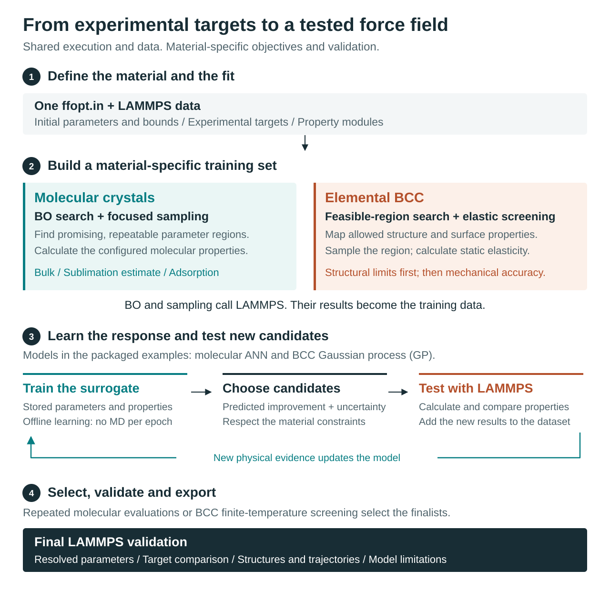

# Workflow and accuracy model

FFOpt is a general framework for developing material force fields. The
currently developed molecular and elemental-BCC workflows share execution,
stored evidence and restart control, but not one universal objective or one
learning model. A fit is specific to a material and a declared model domain.



## What FFOpt learns

For one material and one force-field topology, the surrogate learns

```text
(free epsilon, sigma, charge coordinates) -> LAMMPS-calculated properties
```

The derived neutral charge and optional physics features are reconstructed
before molecular training. Elemental charges are disabled, and tied or derived
LJ values are reconstructed from the independent coordinates. Atom-type
identity is encoded by stable parameter columns;
the model is not a transferable graph neural network across unrelated
materials. A new material requires its own data, targets, ranges, and fit.

## Why BO comes first

LAMMPS can finish for parameter sets that are physically noisy, seed-sensitive,
or close to structural failure. Those points are poor labels even when their
process return code is zero. BO searches broad configured bounds and finds
lower-objective, feasible regions. Its stability audit identifies candidates
whose properties repeat under independent velocity seeds.

BO is an online physical-evaluation loop. The optimizer proposes a batch of
parameter vectors, LAMMPS calculates their properties, FFOpt computes the
objectives, and BO updates its search model before proposing the next batch.
Focused sampling likewise obtains every label from LAMMPS. Surrogate training is the
offline stage: it learns from the stored LAMMPS-labelled table without calling
LAMMPS once per epoch. Active learning then sends only selected surrogate
candidates back to LAMMPS, appends the new labels, and retrains.

BO supplies promising regions for further sampling; it does not prove that a
region is learnable. Replicated calculations and held-out prediction tests
must establish stability and model accuracy. Molecular BO seeks improved
property agreement. BCC BO instead covers the region permitted by structural
and surface constraints; it does not reward moving from an allowed value to
the exact centre of its tolerance interval.

## Why focused sampling follows BO

Surrogate accuracy depends on the sampled domain. Focused sampling uses several
diverse BO centers and several normalized radii, plus an optional global
fraction. Multiple centers reduce dependence on a single local basin;
multiple radii provide both fine gradients and neighborhood coverage. Seed
replicates expose aleatoric simulation variability.

The desired training set is not simply the largest possible CSV. It should
contain successful, repeatable, property-informative parameter vectors near
regions that AL is permitted to explore.

## Learning models

The molecular ANN and the BCC regressor serve the same role: learning the
mapping from force-field parameters to calculated properties. The public
stage name `nn` is historical; it does not mean that every material workflow
uses an artificial neural network. The packaged BCC input selects a Gaussian
process (`nn method gp`); the BCC backend also supports Extra Trees. Its
structure and mechanical-response models are assessed separately.

### Molecular ANN ensemble

Each ANN member is initialized independently. The ensemble mean estimates a
property; disagreement estimates epistemic uncertainty within the training
domain. Per-property held-out R2, RMSE, MAE, residual plots, and train/test
coverage must be inspected. High R2 alone does not prove that the eventual
low-objective region is sampled densely enough.

Extrapolation remains unsafe. An ensemble can agree while all members are
wrong outside the domain they learned.

## Active learning

AL generates candidates within the learned stable envelope, balances predicted
objective and uncertainty, validates selected points with LAMMPS, and retrains
on the new labels. Improvement is measured using LAMMPS objective values, not
surrogate predictions alone.

If AL stalls, repeating the same acquisition is rarely sufficient. Diagnose:

1. Whether the best region lies at a parameter bound.
2. Whether successful data cover more than one local basin.
3. Whether one property dominates residual error.
4. Whether seed variability is larger than the desired improvement.
5. Whether the fixed parameter subset can physically reach the targets.

### BCC constrained refinement

The BCC workflow adds an independent-seed structural audit and a static cubic
elasticity screen to the training-data pipeline. The packaged Fe example
then improves the largest relative error among its configured mechanical
targets (`B/G/E/nu`), subject to measured structural constraints. Born stability
and stress-response quality are additional physical gates. Boundary and
global candidates preserve coverage beyond one local basin.

Static candidates are screened at finite temperature before the final choice.
The promoted winner receives independent, longer-trajectory validation. The
static rank, finite-temperature rank and final-validation evidence are kept
separate. A requested mechanical error tier is a reporting level, not a
guarantee that the LJ model can reach it. See the
[BCC evidence flow](../how-to/elemental-bcc.md#evidence-flow) for the exact
protocol and [transferability limits](../how-to/elemental-bcc.md#ordered-two-type-elemental-warning)
for the scope of the resulting model.

## Molecular robust selection after AL

The lowest single-seed objective is not automatically the final force field.
The audit stage selects the best distinct candidates accumulated through AL,
repeats their LAMMPS evaluations with configured independent seeds, and ranks
them by `mean objective + standard deviation`. Finalization then exports the
best robust candidate with every fixed and neutrality-derived parameter
resolved. This separates surrogate-guided proposal from physical acceptance.

## Final acceptance and limits

The final parameter set is re-evaluated by LAMMPS with production protocols
and saved trajectories. Molecular acceptance can require all three gates:

```text
weighted relative RMSE <= objective_max
every relative property error <= max_error_percent
every absolute property error <= its tolerance
```

One- and two-node profiles should use identical scientific inputs and random
seeds. Their final tables should agree within normal floating-point and
stochastic simulation variation; node count is a performance setting, not a
different optimization protocol.

Passing configured fitting and validation checks establishes performance only
within that tested domain. It does not establish transferability to other
materials, phases or observables. The BCC ordered-sublattice case additionally
reports same-element label sensitivity and the status of transferability
evidence. A final report must preserve limitations and failed checks instead
of converting a best-effort fit into a universal accuracy claim.
